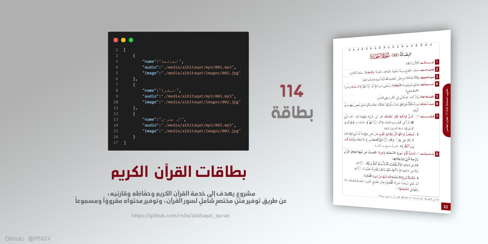

# بطاقات القرآن الكريم | Al-Bitaqat Quran

<div align="center"> 
    
    <br><br>
    
</div>

<br>

> مشروع وقفي عالمي يهدف إلى خدمة القرآن الكريم وحفّاظِهِ وقارئيه، عن طريق توفير مَتْنٍ مختصرٍ شاملٍ لسور القرآن، وتوفير محتواه مقروؤاً ومسموعاً.

---

## نبذة عن المشروع

**كتاب البطاقات** هو برنامج عملي مصاحب لقراءة القرآن الكريم وحفظه، فلا ينتقل القارئ أو الحافظ من سورة إلى أخرى حتى يحفظ بطاقة التعريف الخاصة بها.

- **المؤلف:** أ.د. ياسر بن إسماعيل راضي
- **الموقع الرسمي:** [albitaqat.com](https://albitaqat.com/)
- **عدد السور:** 114 سورة (القرآن الكريم كامل)

---

## المحتويات

| الملف | الوصف |
|-------|-------|
| [`data/quran_cards_full.json`](data/quran_cards_full.json) | البيانات الشاملة لـ 114 سورة مع جميع الروابط |
| [`data/audio_links.json`](data/audio_links.json) | روابط تحميل الصوت (114 ملف MP3) |
| [`data/pdf_links.json`](data/pdf_links.json) | روابط تحميل البطاقات بصيغة PDF (114 ملف) |
| [`data/youtube_videos.json`](data/youtube_videos.json) | فيديوهات شرح البطاقات من يوتيوب (140+) |

---

## هيكل المشروع

```
albitaqat_quran/
├── data/                    # ملفات JSON (بيانات السور)
├── api/                     # Node.js API (Hono + Docker)
├── scripts/                 # سكريبتات Python (Scraping + Downloads)
├── src/                     # كود Python (Downloader)
├── main.py                  # نقطة البداية
├── .gitignore               # ملفات مستبعدة
├── README.md                # هذا الملف
└── STRUCTURE.md             # هيكل المشروع التفصيلي
```

---

## التشغيل السريع

### 1. API مع Docker (الأسهل)

```bash
# بناء وتشغيل
docker build -t albitaqat-api -f api/Dockerfile .
docker run -p 3000:3000 albitaqat-api

# أو مع docker-compose
cd api
docker compose up -d --build
```

**ملاحظة:** عند التشغيل للمرة الأولى، يحمّل جميع ملفات الصوت (114 MP3) و PDF (114 ملف) تلقائياً (~5 دقائق). البيانات تُحفظ في Docker Volume ولا تضيع عند إيقاف الحاوية.

### 2. API محلياً

```bash
cd api
npm install
npm run dev
```

### 3. تحميل الملفات عبر Python

```bash
# تثبيت المتطلبات
pip install -r src/requirements.txt

# تحميل جميع الملفات
python3 src/downloader.py --mode full

# تحميل صوت + يوتيوب
python3 src/downloader.py --mode full --with-youtube

# التحقق من الملفات
python3 src/downloader.py --mode verify
```

---

## API Endpoints

| Method | Endpoint | الوصف |
|--------|----------|-------|
| GET | `/api/health` | فحص صحة الخادم |
| GET | `/api/surahs` | جميع السور (114) |
| GET | `/api/surahs/:number` | سورة برقمها |
| GET | `/api/surahs/slug/:slug` | سورة بالاسم |
| GET | `/api/surahs/search?q=query` | بحث في السور |
| GET | `/api/surahs/type/:type` | مكية/مدنية |
| GET | `/api/audio/:number` | رابط الصوت |
| GET | `/api/pdf/:number` | رابط PDF |
| GET | `/api/youtube/:number` | فيديو يوتيوب |
| GET | `/api/stats` | إحصائيات المشروع |
| GET | `/local/audio/:number` | تحميل صوت محلي |
| GET | `/local/pdf/:number` | تحميل PDF محلي |
| GET | `/local/status` | حالة التخزين المحلي |

### مثال على Response

```json
{
  "success": true,
  "data": {
    "number": 1,
    "name_arabic": "الفاتحة",
    "name_english": "Al-Fatihah",
    "downloads": {
      "audio": {
        "filename": "001_Al-Fatihah.mp3",
        "url": "https://archive.org/download/.../001_Al-Fatihah.mp3",
        "local_url": "/local/audio/1"
      },
      "pdf": {
        "filename": "AlBitaqat-Book-ar_001.pdf",
        "url": "https://archive.org/download/.../AlBitaqat-Book-ar_001.pdf",
        "local_url": "/local/pdf/1"
      },
      "youtube_video": {
        "video_id": "snpE5nt3fPY",
        "title": "البطاقة (1): سُورَةُ الفَاتِحَةِ | البطاقات",
        "url": "https://www.youtube.com/watch?v=snpE5nt3fPY",
        "thumbnail": "https://i2.ytimg.com/vi/snpE5nt3fPY/hqdefault.jpg"
      }
    }
  }
}
```

**ملاحظة:** `local_url` يظهر فقط إذا كان الملف محمّلاً محلياً.

للتفاصيل الكاملة، راجع [`api/README.md`](api/README.md)

---

## روابط التحميل المباشر

### الصوت (MP3)

| النوع | الرابط |
|-------|--------|
| تحميل فردي | `https://archive.org/download/AlBitaqat-Sounds/{filename}.mp3` |
| تحميل جماعي (RAR) | [AlBitaqatAudio.rar](https://archive.org/download/AlBitaqat-Sounds/AlBitaqatAudio.rar) (293 MB) |

### البطاقات (PDF)

| النوع | الرابط |
|-------|--------|
| تحميل فردي | `https://archive.org/download/al-bitaqat-book-ar_pages/AlBitaqat-Book-ar_{NNN}.pdf` |
| تحميل الكتاب كامل | [AlBitaqat-Book-ar.pdf](https://archive.org/download/al-bitaqat-book/AlBitaqat-Book-ar.pdf) (17 MB) |

---

## الفيديوهات

فيديوهات شرح البطاقات متاحة على قناة يوتيوب الرسمية:

- **القناة:** [albitaqat@youtube](https://www.youtube.com/@albitaqat)
- **قائمة الشرح:** [playlist](https://youtube.com/playlist?list=PLe-bd2w3UgbOc9_HoQVebYFUGI-a_A-1n)
- **عدد الفيديوهات:** 140+ فيديو (تغطي جميع السور الـ 114)

---

## معلومات الكتاب

| | |
|---|---|
| **اسم المؤلف** | أ.د. ياسر بن إسماعيل راضي |
| **دار النشر** | دار الميمنة |
| **تاريخ النشر** | 1441 هـ |
| **ردمك** | ISBN: 9786030350469 |
| **عدد الصفحات** | 135 صفحة |

## معلومات التسجيل الصوتي

| | |
|---|---|
| **التسجيل** | استديو وقف تعظيم الوحيين (صدى المنورة) |
| **قارئ النصوص** | الدكتور محمد الشاذلي |
| **قارئ آيات القرآن** | الحافظ: أنس بن ياسر |
| **حجم الملف** | 293.14 ميجا بايت |

---

## الروابط الرسمية

| المنصة | الرابط |
|--------|--------|
| الموقع | [albitaqat.com](https://albitaqat.com/) |
| فيسبوك | [Albitaqat](https://www.facebook.com/Albitaqat) |
| تليجرام | [albitaqatt](https://t.me/albitaqatt) |
| يوتيوب | [albitaqat](https://www.youtube.com/@albitaqat) |
| تويتر | [@albitaqat](https://twitter.com/albitaqat) |

---

## الرخصة

هذا المشروع وقفي لخدمة القرآن الكريم. جميع الحقوق محفوظة للمؤلف.

يمكن استخدام البيانات لأغراض غير تجارية مع الاستشهاد بالمصدر.

---

<div align="center">

**بِالقُرْآنِ نَهْتَدِي، وَبِتَدْبِيرِهِ نَرْتَقِي.**

</div>
